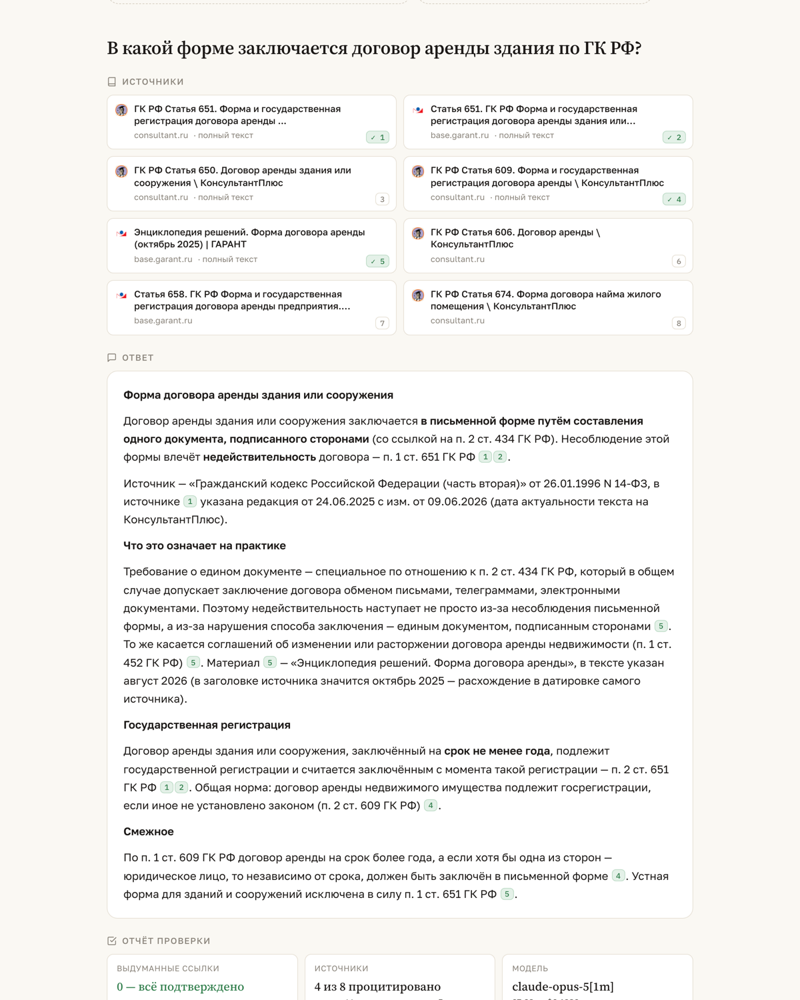
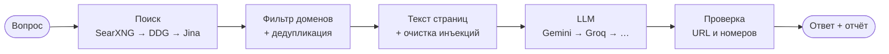
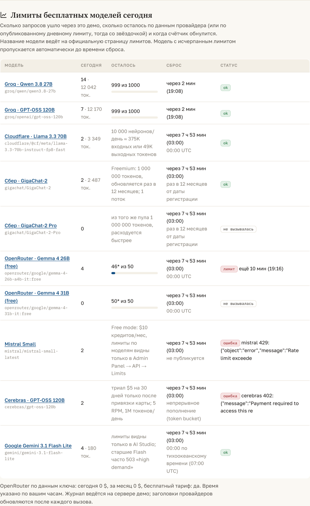

<p align="center">
  <picture>
    <source media="(prefers-color-scheme: dark)" srcset="docs/assets/logo-dark.svg">
    
  </picture>
</p>

<p align="center">
  <strong>Бесплатные LLM + бесплатный веб-поиск + программная проверка каждой ссылки.</strong><br>
  <em>Один интерфейс, автопереключение при исчерпании лимитов, белый список доменов.</em>
</p>

<p align="center">
  <a href="https://github.com/2001092236/groundkit/actions/workflows/ci.yml"></a>
  
  
  <a href="https://2001092236.github.io/groundkit/"></a>
</p>

<p align="center">
  <a href="#readme">Русский</a> · <a href="#english-summary">English</a>
</p>

<p align="center">
  <a href="https://2001092236.github.io/groundkit/"></a>
</p>

---

**Попробовать прямо сейчас:** [2001092236.github.io/groundkit](https://2001092236.github.io/groundkit/) — задайте вопрос, выберите белый список доменов и посмотрите, какие ссылки модель подтвердила, а какие были вырезаны как выдуманные.

## Зачем

Главный риск связки «LLM + поиск» — модель уверенно выдумывает ссылку, которой не было в выдаче. В праве, медицине и финансах это критический дефект, а не косметика. groundkit решает ровно эту задачу и не пытается быть ещё одним чат-приложением:

- **Поиск делает код, а не модель.** Поэтому работает с любой бесплатной моделью и позволяет ограничить домены.
- **Каждый URL и каждый номер `[n]` в ответе сверяется с выдачей.** Чужое вырезается и попадает в отчёт.
- **Модели переключаются автоматически.** Groq → Cloudflare → OpenRouter → Mistral → … Исчерпался дневной лимит или пришёл 429 — берётся следующая, а исчерпанная пропускается до времени сброса.
- **Учёт лимитов.** `groundkit usage` и панель в демо показывают, сколько запросов ушло сегодня, сколько осталось по данным провайдера и когда сброс.
- **Поиск тоже с резервом.** SearXNG (свой, безлимитный) → DuckDuckGo → Exa → Brave → Jina.
- **Claude Code CLI как чистая LLM** — для локальных экспериментов и прогонов эталонных вопросов.

Это тонкая обёртка: поиск делает [SearXNG](https://github.com/searxng/searxng), «экзотические» модели (Gemini, Cloudflare, Anthropic) — [LiteLLM](https://github.com/BerriAI/litellm), а OpenAI-совместимые провайдеры вызываются напрямую, чтобы видеть их заголовки лимитов.

## Быстрый старт

```bash
pip install "groundkit[ddg] @ git+https://github.com/2001092236/groundkit"
export GROQ_API_KEY=...        # console.groq.com/keys — бесплатно, 1000 запросов в день
```

```python
from groundkit import Answerer

qa = Answerer(
    allowed_domains=["consultant.ru", "garant.ru", "pravo.gov.ru"],
    search=["searxng", "ddg"],                 # первый, кто вернул результаты, побеждает
    model=["groq/qwen/qwen3.8-27b", "cloudflare/@cf/meta/llama-3.3-70b-instruct-fp8-fast"],
)
result = qa.ask("В какой форме заключается договор аренды здания по ГК РФ?")

print(result.answer)
for s in result.sources:
    print(f"[{s.index}] {s.title} — {s.url}")
print("Выдуманных ссылок вырезано:", result.dropped_citations)
```

```
Договор аренды здания заключается в письменной форме путём составления одного
документа, подписанного сторонами [1][2]. Несоблюдение формы влечёт
недействительность договора [1]. Договор на срок не менее года подлежит
государственной регистрации [1][2]. Редакция ГК РФ от 24.06.2025 [1].

[1] ГК РФ Статья 651. Форма и государственная регистрация договора аренды здания — https://www.consultant.ru/document/cons_doc_LAW_9027/…
[2] Статья 651 ГК РФ — https://base.garant.ru/10164072/…
Выдуманных ссылок вырезано: []
```

Из терминала то же самое:

```bash
groundkit ask "срок исковой давности по общему правилу" -d consultant.ru,garant.ru
groundkit search "ключевая ставка Банка России" -d cbr.ru
groundkit providers        # что настроено, а что нет
groundkit serve            # веб-демо на http://127.0.0.1:8000
```

## Как это работает



1. **Поиск.** По желанию модель сначала переформулирует разговорный вопрос в поисковый запрос (`rewrite_query=True`, в CLI `--rewrite`): «соседи шумят, как их наказать?» → «нарушение тишины во дворе жилого дома ответственность». Провайдеры пробуются по очереди; результаты фильтруются по белому списку доменов (с поддоменами) на нашей стороне, поэтому поведение одинаково у всех.
2. **Контекст.** Для первых страниц скачивается полный текст (а не 200 символов сниппета). Из текста вырезаются фразы вида «ignore previous instructions» — базовая защита от prompt injection.
3. **Модель.** Нумерованные источники подаются модели с жёстким системным промптом: только по источникам, ссылаться номерами, указывать дату редакции.
4. **Проверка.** Каждый URL в ответе нормализуется и ищется среди результатов; каждый `[n]` проверяется на диапазон. Отсутствующее заменяется пометкой и попадает в `dropped_citations` / `dropped_indices`.

## Бесплатные модели

Ключи кладутся в `.env` (см. [`.env.example`](.env.example)). Порядок в таблице — порядок автопереключения. Модели и лимиты проверены живыми вызовами 4 сентября 2026; каталоги провайдеров меняются, `groundkit providers` покажет актуальное состояние.

| Модель | Ключ | Бесплатно (по официальным страницам) | Заметка |
|---|---|---|---|
| `groq/qwen/qwen3.8-27b` | [`GROQ_API_KEY`](https://console.groq.com/keys) | [1000 запросов/день, 30 RPM, 8K токенов/мин, 200K токенов/день](https://console.groq.com/docs/rate-limits) | Дефолт: быстро и без карты. Из России API недоступен, нужен сервер за рубежом |
| `groq/openai/gpt-oss-120b` | тот же | те же лимиты, отдельный счётчик | Рассуждающая модель, второй «карман» на том же ключе |
| `cloudflare/@cf/meta/llama-3.3-70b-instruct-fp8-fast` | [`CLOUDFLARE_API_KEY` + `CLOUDFLARE_ACCOUNT_ID`](https://dash.cloudflare.com) | [10 000 нейронов/день](https://developers.cloudflare.com/workers-ai/platform/pricing/) ≈ 375K входных или 49K выходных токенов, сброс 00:00 UTC | Работает отовсюду, ~1.5–3 с на ответ |
| `gigachat/GigaChat-2` | [`GIGACHAT_AUTH_KEY`](https://developers.sber.ru/studio) | [Freemium: 1 000 000 токенов, обновление раз в 12 месяцев](https://developers.sber.ru/docs/ru/gigachat/tariffs/individual-tariffs), 1 поток | Лучше остальных пишет по-русски. Работает и из России, и с зарубежного сервера. Нужен сертификат Минцифры, см. ниже |
| `openrouter/google/gemma-4-26b-a4b-it:free` | [`OPENROUTER_API_KEY`](https://openrouter.ai/keys) | [50 запросов/день на все free-модели, 20 RPM](https://openrouter.ai/docs/api-reference/limits); 1000/день при разовом пополнении ≥ $10 | Общий пул, бывает «temporarily rate-limited upstream» |
| `mistral/mistral-small-latest` | [`MISTRAL_API_KEY`](https://console.mistral.ai) | [Free mode: $10 кредитов/мес](https://docs.mistral.ai/admin/billing-usage/usage-limits), лимиты по моделям — в Admin Panel → API → Limits | Наш ключ отвечает 429 с лимитом 0 запросов/мин: в консоли нужно включить Free mode |
| `cerebras/gpt-oss-120b` | [`CEREBRAS_API_KEY`](https://cloud.cerebras.ai) | [триал $5 на 30 дней, 5 RPM, 1M токенов/день](https://inference-docs.cerebras.ai/support/rate-limits) | Доступ включается только после привязки карты, до этого 402 |
| `gemini/gemini-3.1-flash-lite` | [`GEMINI_API_KEY`](https://aistudio.google.com/apikey) | [лимиты видны только в AI Studio](https://ai.google.dev/gemini-api/docs/rate-limits), сброс в полночь по тихоокеанскому времени | Старшие Flash на бесплатном тарифе часто отвечают 503 «high demand»; из РФ API недоступен |
| `anthropic/claude-haiku-4-5-20251001` | [`ANTHROPIC_API_KEY`](https://console.anthropic.com) | платно | Для продакшна |
| `claude-cli` | — | в рамках подписки | См. ниже |

Любая другая модель, которую знает LiteLLM, подключается строкой: `model="openrouter/minimax/minimax-m2.7:free"`.

Контекст для модели по умолчанию ограничен 12 000 символами на все источники: бесплатные тарифы режут не только запросы в день, но и токены в минуту (Groq — 8K). Поднимается параметром `Answerer(max_context_chars=...)`.

⚠️ На бесплатных уровнях запросы обычно используются провайдерами для обучения — не подавайте туда чувствительные данные. Cohere free — только некоммерческое использование.

### GigaChat: ключ и сертификат

Ключ авторизации берётся в [Сбер Studio](https://developers.sber.ru/studio): создайте проект GigaChat API, скопируйте **Authorization key** (это base64 от `client_id:client_secret`) в `GIGACHAT_AUTH_KEY`. Токен доступа живёт 30 минут, groundkit обновляет его сам.

Серверы Сбера подписаны сертификатом «Russian Trusted Root CA» Минцифры, которого нет в стандартных бандлах. В Docker-образе он уже вшит, локально:

```bash
curl -o ~/russian_trusted_root_ca.cer https://gu-st.ru/content/Other/doc/russian_trusted_root_ca.cer
export GIGACHAT_CA_BUNDLE=~/russian_trusted_root_ca.cer
```

Без `GIGACHAT_CA_BUNDLE` запрос всё равно уйдёт, но с отключённой проверкой TLS и предупреждением в логе — для продакшна так делать не стоит.

## Картинки

Тот же принцип, что и с текстом: провайдеры за одним интерфейсом, вызовы попадают в журнал лимитов, ключи не обязательны.

```python
from groundkit import generate_image

img = generate_image("уютная юридическая библиотека, тёплый свет", size=(768, 512), seed=7)
img.save("library.jpg")          # расширение подставится по типу картинки
print(img.provider, img.model, img.width, img.height)
```

```bash
groundkit image "схема процесса согласования договора" --size 1024x768 -o scheme
```

| Провайдер | Ключ | Бесплатно | Модель |
|---|---|---|---|
| `pollinations` | не нужен | [без ключа 1 запрос в 15 с, с бесплатным токеном — в 5 с](https://auth.pollinations.ai) | `sana`. `flux` и `turbo` — псевдонимы к ней на бесплатном тарифе |
| `cloudflare` | `CLOUDFLARE_API_KEY` + `CLOUDFLARE_ACCOUNT_ID` | из общих [10 000 нейронов в день](https://developers.cloudflare.com/workers-ai/models/flux-1-schnell/) | FLUX.1 schnell. Всегда отдаёт 1024×1024 и не принимает `seed` |

`size` — пожелание, а не обещание: провайдер вправе вернуть другой размер, поэтому `img.width` и `img.height` читаются из самой картинки. Обрывы связи повторяются автоматически (два раза), ответы с кодом ошибки — нет.

Токен Pollinations кладётся в `POLLINATIONS_TOKEN` и включает `nologo` и `private` (картинка не попадает в публичную ленту). Без токена запросы анонимные, а картинки публичны — не подавайте туда ничего чувствительного. У `ImageResult` есть `save()`, `to_data_uri()` и `to_dict()`; при отказе одного провайдера `generate_image` берёт следующего.

## Лимиты: сколько осталось и когда сброс

groundkit ведёт простой журнал вызовов (`~/.groundkit/usage.json`, в Docker — том `usage_data`): сколько запросов ушло сегодня по каждой модели, сколько токенов, что провайдер прислал в заголовках `x-ratelimit-*` (остаток, лимит, время сброса) и когда модель ответила 429.

```bash
groundkit usage
```

```
модель                                               сегодня  осталось  сброс (UTC)          статус
groq/qwen/qwen3.8-27b                                     12       988  13:41                ok
cloudflare/@cf/meta/llama-3.3-70b-instruct-fp8-fast        3         —                       ok
openrouter/google/gemma-4-26b-a4b-it:free                  2       48*  00:00                ok
mistral/mistral-small-latest                               1         —                       лимит до 12:52
* — оценка по известному дневному лимиту, провайдер точных данных не прислал
```

То же самое отдаёт `GET /api/usage`, а на странице демо есть панель «Лимиты бесплатных моделей сегодня»:

<p align="center"></p>

Groq, Cerebras, Mistral и OpenRouter вызываются напрямую через их OpenAI-совместимые API, поэтому остаток и время сброса берутся из заголовков `x-ratelimit-*` самого провайдера; остальные модели идут через LiteLLM, для них остаток оценивается по известному дневному лимиту. Модель, ответившая 429, автоматически пропускается в цепочке до времени сброса из заголовков (или 10 минут, если провайдер его не сообщил).

## Поиск

| Провайдер | Ключ | Бесплатно | Что отдаёт |
|---|---|---|---|
| `searxng` | нет, свой инстанс | безлимитно | Метапоиск по 70+ движкам. `docker compose` ниже поднимает его за минуту |
| `ddg` | нет | без ключа | Через пакет `ddgs`. Резерв, если SearXNG нет |
| `jina` | [`JINA_API_KEY`](https://jina.ai) | [10M токенов на новый ключ, 100 RPM](https://jina.ai/reader/) | Сразу с текстом страниц. Без ключа отвечает 401 |
| `exa` | [`EXA_API_KEY`](https://dashboard.exa.ai) | [$10 кредитов/мес ≈ 1400 поисков](https://exa.ai/pricing), новым аккаунтам ещё $20 | Нейропоиск по смыслу, полный текст |
| `brave` | [`BRAVE_API_KEY`](https://brave.com/search/api) | 2000/мес | Независимый индекс |

Свой провайдер — любой объект с полем `name` и методом `search(query, limit) -> list[SearchResult]`; передаётся в `Answerer(search=[MyProvider()])`.

<details>
<summary><b>Связки: качество против цены</b></summary>

| Связка | Цена | Когда брать |
|---|---|---|
| SearXNG + Groq | $0 | Дефолт. Ноль затрат, полный контроль, быстро |
| Exa + Cloudflare | $0 до 20K/мес | Когда важен смысловой поиск |
| SearXNG → Exa → Brave + Groq → Cloudflare → OpenRouter | $0 | Продакшн на бесплатных лимитах |
| Firecrawl + Claude/GPT | $$ | Платный уровень продукта |

По независимым замерам в верхнем эшелоне качества — Brave, Exa, Parallel, Firecrawl; Tavily при огромной популярности стабильно уступает лидерам и иногда отдаёт битые ссылки из кэша.
</details>

## Claude Code CLI как LLM

Для собственных экспериментов — прогнать эталонный набор вопросов, сравнить с бесплатными моделями — удобно использовать установленный Claude Code как чистую модель, без файловых операций:

```bash
export GROUNDKIT_CLAUDE_CLI=1
groundkit ask "вопрос" -m claude-cli            # или claude-cli/sonnet, claude-cli/opus
```

```python
from groundkit import Answerer, ClaudeCLI
qa = Answerer(model=ClaudeCLI(model="sonnet"), search="ddg")
```

Под капотом: `claude -p --max-turns 1 --tools "" --output-format json --system-prompt … --bare`. Флаг `--bare` отключает CLAUDE.md, хуки, скиллы и MCP; если в таком режиме CLI не видит авторизацию, groundkit сам повторяет без него. Ручной вариант:

```bash
printf 'вопрос' | claude -p --bare --max-turns 1 --tools "" --output-format json
```

**Граница допустимого.** Личные эксперименты через официальный CLI — нормально. Использовать подписку как бэкенд приложения для чужих пользователей нельзя: это нарушает Consumer Terms Anthropic и ведёт к блокировке. Поэтому в веб-демо Claude CLI выключен, если явно не задан `GROUNDKIT_CLAUDE_CLI=1`, а для продакшна берите API-ключ (`anthropic/…`).

<details>
<summary><b>Бесплатные CLI других вендоров</b></summary>

Qwen Code даёт 2000 запросов в день через OAuth аккаунта qwen.ai. Gemini CLI давал 1000/день, но 18 июня 2026 Google объявил переход на Antigravity CLI, и потребительские планы бесплатный доступ теряют.
</details>

## Веб-демо и HTTP API

```bash
pip install "groundkit[web,ddg] @ git+https://github.com/2001092236/groundkit"
groundkit serve                        # http://127.0.0.1:8000, Swagger — /api/docs
```

| Метод | Путь | Что делает |
|---|---|---|
| `GET` | `/api/config` | Что настроено: поиск, модели, пресеты доменов, лимиты демо |
| `POST` | `/api/image` | Картинка: `{"prompt", "provider", "width", "height", "seed"}` → метаданные и сама картинка как data-URI |
| `GET` | `/api/usage` | Учёт лимитов: использовано сегодня, остаток, время сброса по каждой модели |
| `POST` | `/api/search` | Только поиск: `{"query", "domains", "search", "limit"}` |
| `POST` | `/api/ask` | Поиск + модель + проверка: добавляются `"model"`, `"fetch_pages"` |

На странице демо две вкладки: ответ с проверенными источниками и генерация картинки. Картинки отключаются переменной `GROUNDKIT_IMAGES=0`, если не хотите тратить на них лимиты.

Демо защищено лимитом на IP (`GROUNDKIT_RPM`, `GROUNDKIT_RPD`) и, по желанию, токеном `GROUNDKIT_ACCESS_TOKEN`. Страница демо статическая: её можно положить на GitHub Pages и указать адрес API в настройках.

### Полный стенд в Docker

SearXNG + API + Caddy с автоматическим HTTPS:

```bash
git clone https://github.com/2001092236/groundkit && cd groundkit
cp .env.example .env                     # вписать GEMINI_API_KEY / GROQ_API_KEY
# в .env: GROUNDKIT_DOMAIN=groundkit.1-2-3-4.sslip.io
docker compose --env-file .env -f docker/docker-compose.yml up -d --build
```

Без своего домена подойдёт [sslip.io](https://sslip.io): имя вида `groundkit.1-2-3-4.sslip.io` резолвится в `1.2.3.4`, и Caddy получает сертификат Let's Encrypt сам.

## Что возвращает `ask()`

| Поле | Смысл |
|---|---|
| `answer` | Текст ответа с `[n]`; неподтверждённые URL заменены пометкой |
| `sources` | Список `SearchResult`: `index`, `title`, `url`, `domain`, `snippet`, `published`, `content` |
| `cited` | Номера источников, на которые модель реально сослалась |
| `dropped_citations`, `dropped_indices` | Выдуманные URL и номера вне диапазона |
| `injection_flagged` | В источниках был текст, похожий на инструкции модели |
| `model`, `llm.attempts` | Какая модель ответила и история переключений |
| `search_provider`, `search_query`, `search_errors` | Какой поиск сработал, какой запрос ушёл в поиск и почему не сработали остальные |
| `timing` | `search_s`, `fetch_s`, `llm_s`, `total_s` |

## Разработка

```bash
git clone https://github.com/2001092236/groundkit && cd groundkit
python -m venv .venv && . .venv/bin/activate
pip install -e ".[dev]"
ruff check . && pytest -q                    # 53 юнит-теста, без сети
GROUNDKIT_LIVE=1 pytest -m live -s           # живые: DuckDuckGo, Claude CLI, ключи из .env
```

## Границы применимости

- **Это не замена RAG по своей базе.** Веб-поиск даёт худшее качество, чем курируемый корпус: устаревшие редакции хорошо ранжируются, пересказы содержат неточности. Используйте как промежуточное решение или дополнение.
- **SearXNG — агрегатор, не индекс.** При агрессивном опросе движки временно блокируют инстанс. Не гоните тысячи запросов в минуту.
- **Защита от инъекций — базовая.** Для продакшна смотрите в сторону AgentSearch с полноценной очисткой.
- **Соблюдайте robots.txt и пользовательские соглашения** сайтов. Не обходите CAPTCHA, антибот-защиту и платный доступ.

<details>
<summary><b>Что уже существует и чем groundkit отличается</b></summary>

| Проект | Что делает | Когда брать вместо groundkit |
|---|---|---|
| [llmbuffet](https://pypi.org/project/llmbuffet/), [freelm](https://pypi.org/project/freelm/) | Пулинг 6–15 бесплатных LLM-провайдеров за OpenAI-совместимым эндпоинтом | Нужен только пулинг моделей |
| [Perplexica / Vane](https://github.com/ItzCrazyKns/Perplexica), [Morphic](https://github.com/miurla/morphic), [Khoj](https://github.com/khoj-ai/khoj) | Готовые answer-engine с чатом | Нужен готовый чат-интерфейс, а не библиотека |
| [WebSearchFree](https://github.com/), [AgentSearch](https://github.com/), [SearchNow](https://pypi.org/project/searchnow/) | Бесплатный поиск + извлечение текста | Нужен только поиск |

groundkit закрывает то, чего нет в готовом виде: связка «бесплатная LLM + бесплатный поиск» **с жёстким белым списком доменов и программной проверкой ссылок**, встраиваемая в свой бэкенд как библиотека.
</details>

## English summary

**groundkit** is a thin Python library that pairs *free* LLMs (Gemini Flash, Groq, OpenRouter, … via LiteLLM with automatic fallback when a daily quota runs out) with *free* web search (self-hosted SearXNG, DuckDuckGo, Jina, Exa, Brave) and, crucially, **programmatic citation verification**: every URL and every `[n]` in the answer is checked against the actual search results; anything hallucinated is cut out and reported. Domains are whitelisted, page text is fetched and sanitised against prompt injection, and Claude Code CLI can be used as a plain LLM for local experiments. Ships with a CLI, a FastAPI demo with a static front-end, and a Docker stack (SearXNG + API + Caddy HTTPS). MIT.

---

<p align="center">MIT · сделано для проектов, где выдуманная ссылка — это дефект, а не мелочь.</p>
